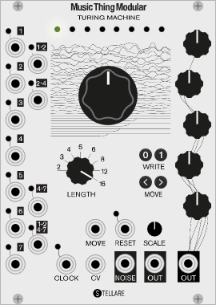
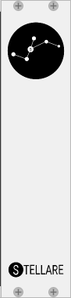

# Stellare Modular modules for VCV Rack #

For Enzo and Sander to have inspirational beer drinking sessions in Berlin to come up with brand new groovy ideas for new Rack modules we would appreciate donations, please use the link below.

[Donate through Paypal](https://paypal.me/stellaremodular)

## Music Thing Turing Machine

The Turing Machine module is based on the amazing Music Thing's Turing Machine Eurorack module by Tom Whitwell. We recreated the modules based on the original schematics of the Mk2 version. Besides the main module we also created the two Mk2 expanders: Volts and Pulses.

## Link ##
The link module is a very simple module which provides a 'link' connection with a link enabled application like Ableton Live. It will allow you also to connect two or more VCV rack instances on different computers together which are connected in the same WLAN or LAN. In order to sync perfectly we added a Offset control so you can compensate for any latency introduced in the Link connection.

## Blank Panel ##
A beatufiul Stellare Modular blank panel to spice up your VCV virtual rack.

